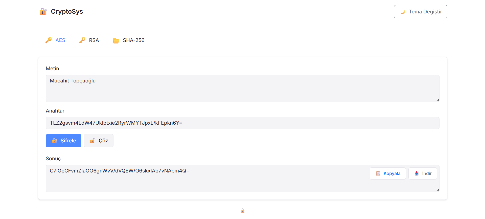
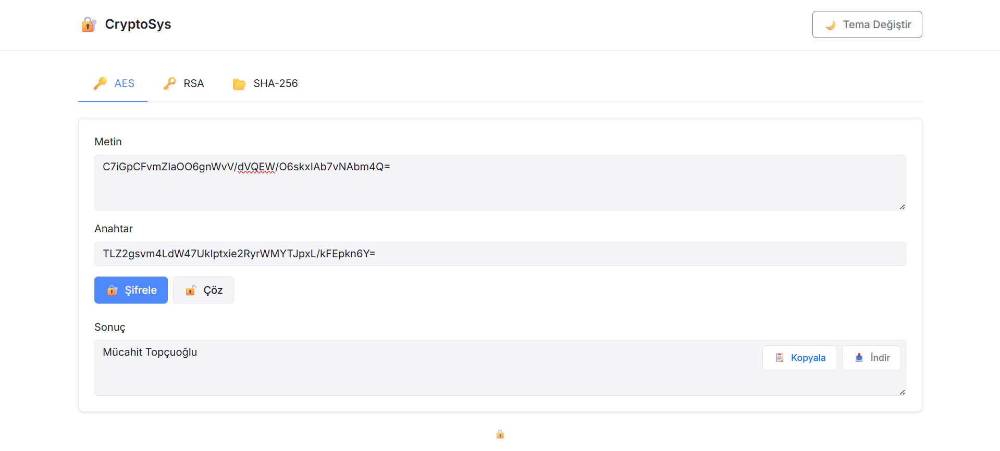

# Kriptografi Web Uygulaması

Bu proje, AES ve RSA şifreleme algoritmaları ile SHA256 hash fonksiyonunu içeren bir web uygulamasıdır. Backend tarafında C# ve frontend tarafında HTML, CSS ve JavaScript kullanılarak geliştirilmiştir.

## AES 

### Ekran Görüntüleri
#### AES Şifreleme

#### AES Şifre Çözme


### Özellikler
- Metin şifreleme ve çözme
- 256-bit anahtar desteği
- Base64 formatında şifrelenmiş çıktı

### Kullanım
1. "AES" sekmesini seçin
2. Şifrelenecek metni girin
3. Bir anahtar girin
4. "Şifrele" veya "Çöz" butonuna tıklayın
5. Sonuç otomatik olarak kopyalanabilir formatta görüntülenecektir

## RSA 

### Ekran Görüntüleri
#### RSA Şifreleme

#### RSA Şifre Çözme


### Özellikler
- Otomatik anahtar çifti oluşturma
- Public key ile şifreleme
- Private key ile çözme
- 2048-bit anahtar uzunluğu
- OAEP padding desteği
- Base64 formatında şifrelenmiş çıktı

### Kullanım
1. "RSA" sekmesini seçin
2. "Anahtar Oluştur" butonuna tıklayın
3. Oluşturulan public ve private keyleri kopyalayın
4. Şifrelenecek metni girin ve public key ile şifreleyin
5. Şifrelenmiş metni private key ile çözün
6. Tüm anahtarlar ve sonuçlar kopyalanabilir formatta sunulur

## SHA256 Hash

### Ekran Görüntüleri
#### SHA256 Metin Hashleme

#### SHA256 Dosya Hashleme


### Özellikler
- Metin hash'leme
- Dosya hash'leme
- Hexadecimal formatında çıktı
- Büyük dosyalar için akış tabanlı işleme
- Anlık hash hesaplama

### Kullanım
1. "SHA256" sekmesini seçin
2. Metin hash'leme için:
   - Metni girin
   - "Hash'le" butonuna tıklayın
3. Dosya hash'leme için:
   - "Dosya Seç" butonuna tıklayın
   - Dosyayı seçin
   - "Hash'le" butonuna tıklayın
4. Hash sonucu otomatik olarak kopyalanabilir formatta görüntülenecektir

## Kurulum

1. Projeyi klonlayın:
```bash
git clone [proje-url]
```

2. Proje dizinine gidin:
```bash
cd CryptoAPI
```

3. Bağımlılıkları yükleyin:
```bash
dotnet restore
```

4. Uygulamayı çalıştırın:
```bash
dotnet run
```

5. Tarayıcınızda aşağıdaki adresi açın:
```
https://localhost:5001
```


## İletişim
- Email: mmucahittopcuoglu@gmail.com
